# ZJU-blockchain-course-2025

⬆ 可以️修改成你自己的项目名。

> 第二次作业要求（以下内容提交时可以删除）：
> 
> 进阶的去中心化彩票系统，参与方包括：竞猜玩家、公证人
>
> **背景**：传统的体育彩票系统（例如我国的体育彩票）一般没有彩票交易功能：例如，对于“NBA本赛季MVP为某球员/F1的赛季总冠军为某车队”这类持续时间长的事件的下注一般在赛季开始前就会买定离手，这使得一旦出现突发或不确定事件（如球员A赛季报销/球队B买入强力球星/C车队车手受伤等），很多玩家的选择便会立即失去意义，导致彩票游戏的可玩性下降。因此，一个有趣的探索方向是让彩票系统拥有合规、方便的交易功能。
>
> 建立一个进阶的去中心化彩票系统（可以是体育彩票，或其它任何比赛节目的竞猜，例如《中国好声音》《我是歌手》年度总冠军等，可以参考 [Polymarket](https://polymarket.com/) ），在网站中：
> - 公证人（你自己）可以创立许多竞猜项目：例如某场比赛的输赢、年度总冠军的得主等，每个项目应当有2个或多个可能的选项，一定的彩票总金额（由公证人提供），以及规定好的结果公布时间。
> - 玩家首先领取到测试所需以太币。在网站中，对于一个竞猜项目和多个可能的选项：
>   1. 每个竞彩玩家都可以选择其中的某个选项并购买一定金额（自己定义）的彩票，购买后该玩家会获得一张对应的彩票凭证（一个 ERC721 合约中的 Token）
>   2. 在竞彩结果公布之前，任何玩家之间可以买卖他们的彩票，以应对项目进行期间的任何突发状况。具体的买卖机制如下：一个玩家可以以指定的金额挂单出售（ERC721 Delegate）自己的彩票，其它玩家如果觉得该彩票有利可图就可以买入他的彩票。双方完成一次 ERC721 Token 交易。
>   3. 公证人可以在时间截止时（简单起见，你可以随时终止项目）输入竞猜的结果并进行结算。所有胜利的玩家可以平分奖池中的金额。
> - Bonus（最多5分，若想要完成，可以直接将功能整合进上述要求中）：
>   1. （2分）发行一个 ERC20 合约，允许用户领取 ERC20 积分，并使用ERC20积分完成上述流程。
>   2. （3分）对交易彩票的过程实现一个简单的链上订单簿：卖方用户可以以不同价格出售一种彩票，网页上显示当前订单簿的信息（多少价格有多少该彩票正在出售）。其他用户可以根据最优价格购买彩票。
> - 可以对上述需求进行合理更改和说明。请大家专注于功能实现，网站UI美观程度不纳入评分标准，能让用户能够舒适操作即可。

**以下内容为作业仓库的README.md中需要描述的内容。请根据自己的需要进行修改并提交。**

作业提交方式为：**提交视频文件**和**仓库的链接**到指定邮箱。

## 如何运行

补充如何完整运行你的应用。

1. 在本地启动ganache应用,gas limit要稍微设置的高一点，同时PORT NUMBER要设为8545，network ID可能也要设置(我本地跑不需要)
 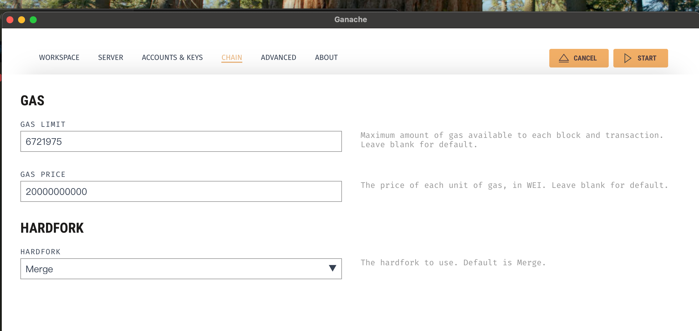
3. 下载metamask拓展，左上角选择网络，添加自定义网络
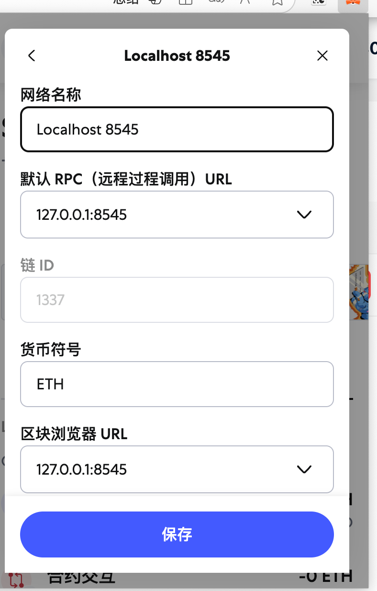

1. 在 `./contracts` 中安装需要的依赖，运行如下的命令：
    ```bash
    npm install
    ```
2. 在 `./contracts` 中编译合约，运行如下的命令：
    ```bash
    npx hardhat compile
    ```
3. 在 `./contracts` 中部署合约，运行如下的命令：
    ```bash
    npx hardhat run scripts/deploy.ts --network ganache
    ```
4. 在 `./frontend` 中安装需要的依赖，运行如下的命令：
    ```bash
    npm install
    ```
5. 在 `./frontend` 中启动前端程序，运行如下的命令：
    ```bash
    npm  start
    ```

## 功能实现分析

简单描述：项目完成了要求的哪些功能？每个功能具体是如何实现的？

本项目是一个去中心化的彩票系统，旨在为用户提供竞猜、交易彩票以及活动管理的功能。管理员可以创建活动并管理奖池，用户可以参与活动、购买彩票、交易彩票，并在活动结束后根据结果分配奖池金额
功能如下：

### 管理员功能

#### 1. 创建活动 (createGameRound)
**功能描述：** 管理员可以创建活动，设置活动名称、描述、选项、开始时间、结束时间、单张彩票金额以及奖池总金额。

**实现细节：**
- 使用 `onlyManager` 修饰符确保只有管理员可以调用
- 验证开始时间必须早于结束时间，结束时间必须在未来
- 创建新的 `GameRound` 结构体，存储活动的所有信息
- 根据当前时间设置活动状态为 `NotStarted` 或 `Ongoing`
- 为活动奖池铸造对应的积分代币
- 活动计数器自增

#### 2. 提前结束活动并退款 (refund)
**功能描述：** 管理员可以提前结束活动并退款给参与者。

**实现细节：**
- 使用 `onlyManager` 修饰符限制调用权限
- 调用 `ticketsManager.findowners(activityId)` 获取所有彩票持有者和数量
- 遍历所有持有者，按持有的彩票数量和单价计算退款金额
- 通过 `pointsManager.transfer` 将积分退还
- 将活动状态设置为 `Finished` 并调用 `ActivityEnded` 结束所有相关彩票

#### 3. 开奖 (draw)
**功能描述：** 管理员可以根据活动结果进行开奖，胜者分配奖池金额。

**实现细节：**
- 使用 `onlyManager` 修饰符限制调用权限
- 调用 `ticketsManager.findwiners(activityId, choice)` 查找获胜选项的所有彩票持有者
- 计算每张获胜彩票应得的金额 = 奖池总额 / 获胜彩票总数
- 遍历所有持有者，按持有的获胜彩票数量分配积分
- 将活动状态设置为 `Finished` 并调用 `ActivityEnded` 结束所有相关彩票

### 用户功能

#### 1. 领取空投积分 (airdrop)
**功能描述：** 用户可以领取初始积分，用于购买彩票。

**实现细节：**
- 在 `Points` 合约中实现
- 使用 `hasClaimedAirdrop` 映射防止重复领取
- 通过 `_mint` 铸造 10000 积分给用户
- 将用户标记为已领取状态

#### 2. 购买彩票 (play)
**功能描述：** 用户可以选择活动和选项，购买一定数量的彩票。

**实现细节：**
- 验证活动状态为 `Ongoing`
- 验证用户选择的选项在活动的有效选项中（调用 `validchoice`）
- 检查用户积分余额是否足够支付
- 通过 `transferFrom` 从用户账户转移积分到合约
- 记录用户参与状态并添加到玩家列表
- 调用 `ticketsManager.mintTicket` 铸造对应数量的彩票 ERC721 代币
- 更新活动的奖池总额

#### 3. 查看彩票和积分 (getUserCompleteInfo)
**功能描述：** 用户可以查看自己的彩票详情和积分余额。

**实现细节：**
- 调用 `pointsManager.balanceOf(user)` 获取用户积分余额
- 调用 `ticketsManager.getUserTickets(user)` 获取用户的所有彩票信息
- 返回用户的完整信息，包括彩票总数、每张彩票的详情、在售彩票信息等

#### 4. 售卖彩票 (sellTicket)
**功能描述：** 用户可以将彩票挂单出售，并设置价格。

**实现细节：**
- 在 `Tickets` 合约中实现
- 验证调用者是彩票的所有者
- 创建 `TicketSaleInfo` 记录售价信息
- 将彩票状态设置为 `Selling`
- 将彩票添加到 `ticketsonsale` 数组中
- 记录彩票在数组中的索引以便后续删除

#### 5. 购买其他用户的彩票 (buyticket)
**功能描述：** 用户可以购买其他用户挂单的彩票。

**实现细节：**
- 获取彩票的售价信息
- 通过 `transferFrom` 将积分从买家转移给卖家
- 调用 `ticketsManager.tickettransfer` 完成彩票所有权的转移
- 将彩票状态改回 `Ongoing` 并从在售列表中移除


## 项目运行截图
首先是管理员创建活动
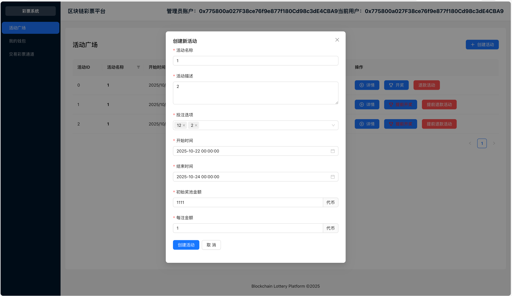
创建完后如下
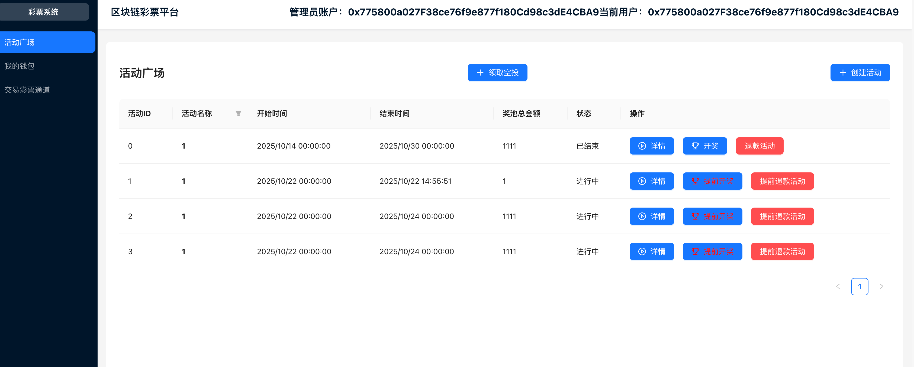
然后是投注
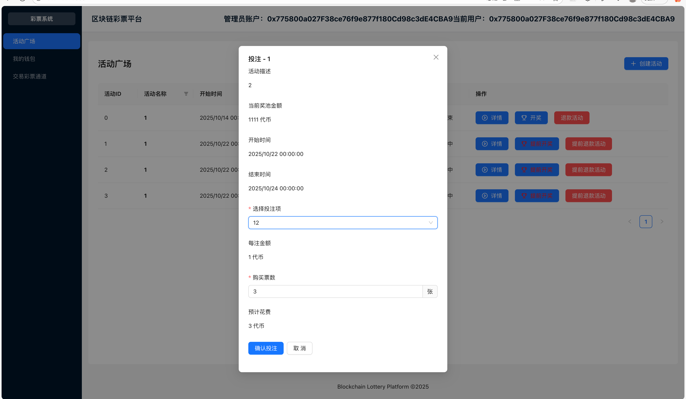
投注完查看票数和钱包
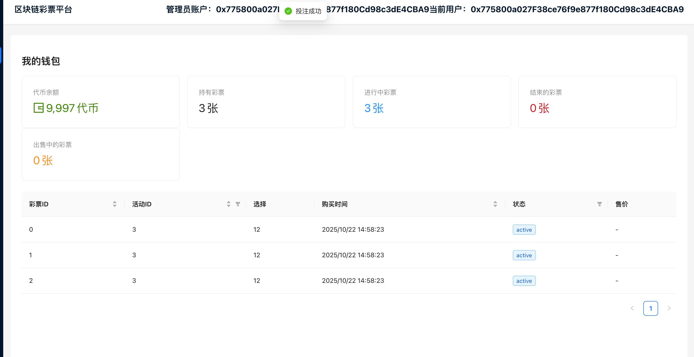
此处为了避免被误认一开始是写死的再买三张
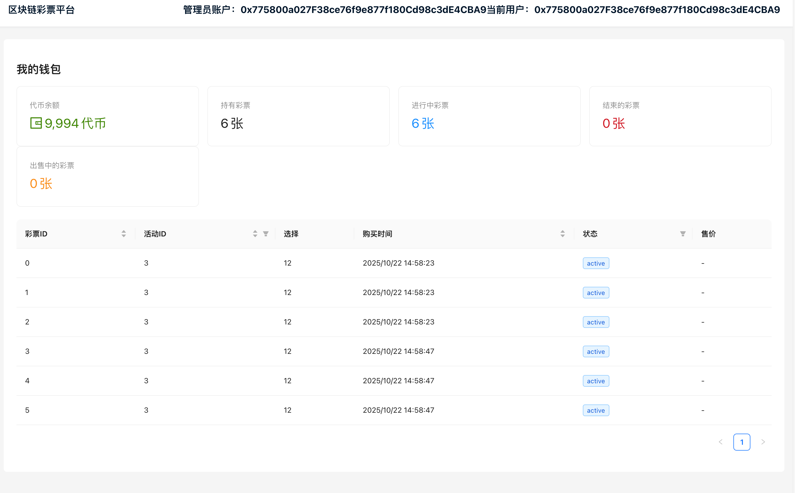
此处给个买彩票的钱包图
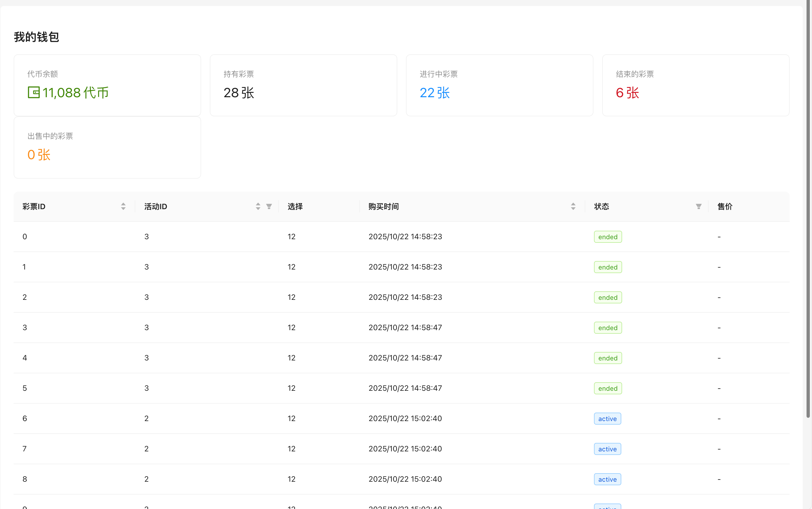
然后结束活动开奖
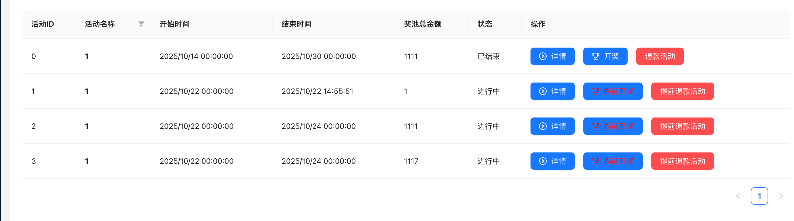
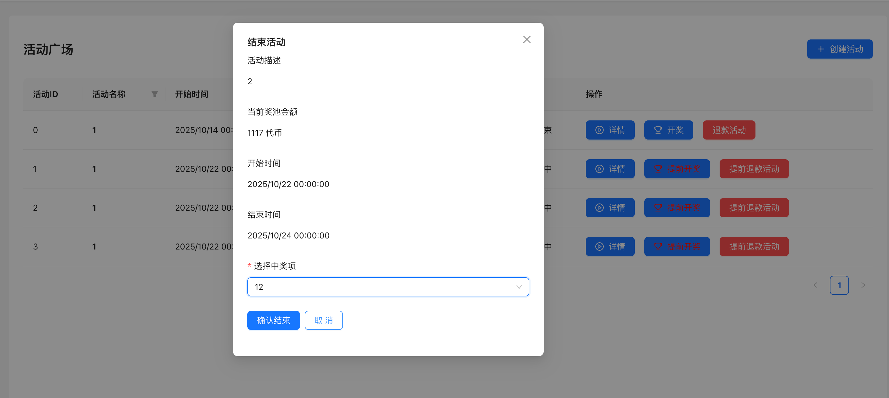
发现该人钱变多了，彩票状态变了
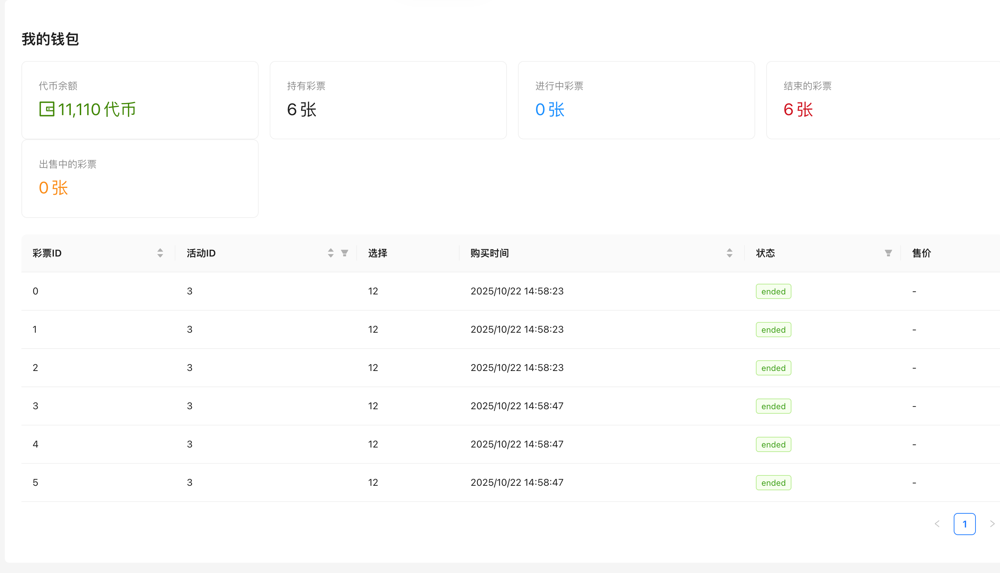
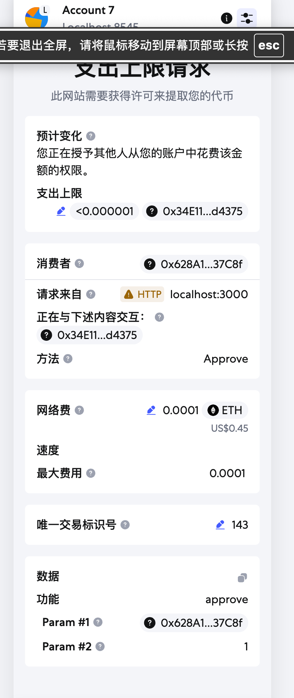
然后是彩票交易功能
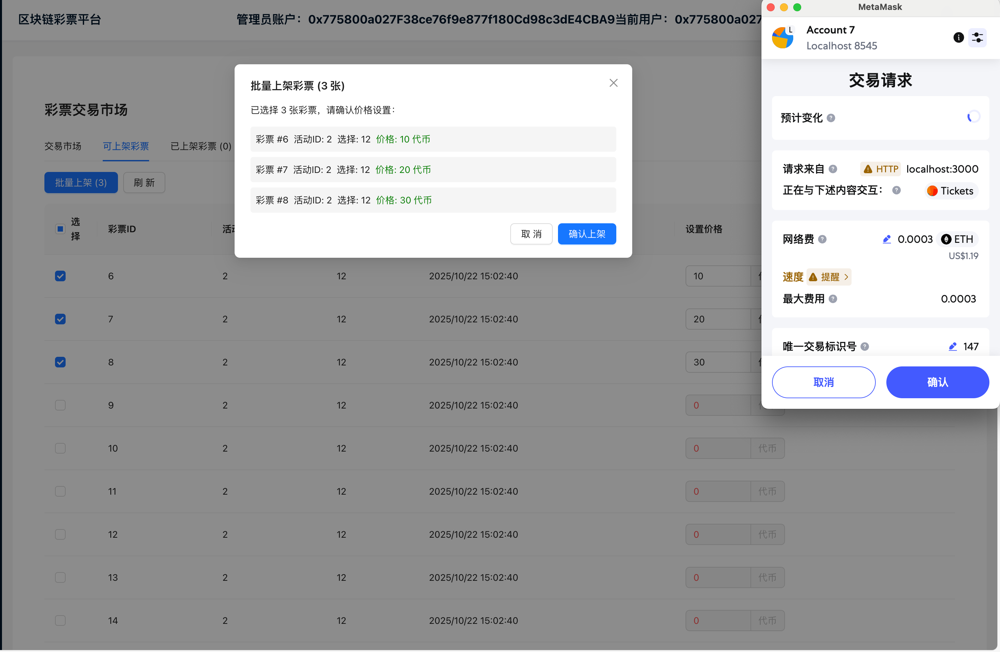
此处可以看到上架了

然后下架功能
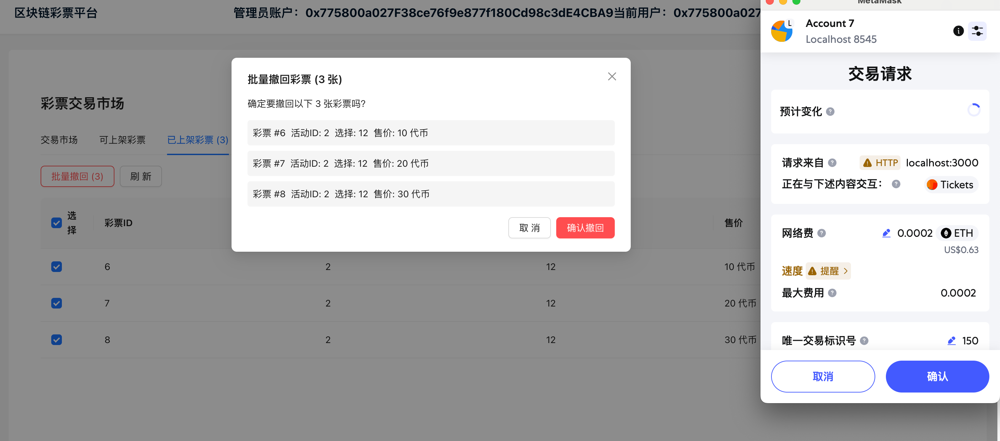
可以看到下架了
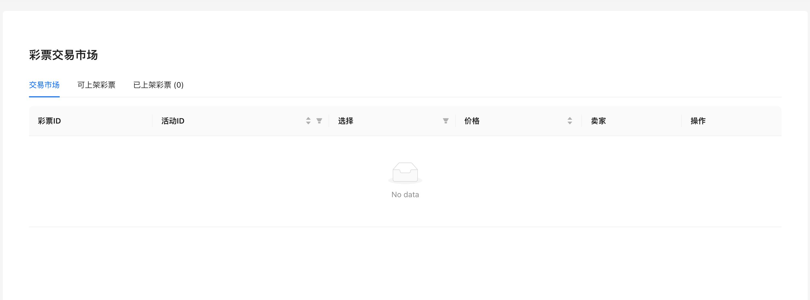
看到我们钱包中有出售彩票信息

此处开个新的账户
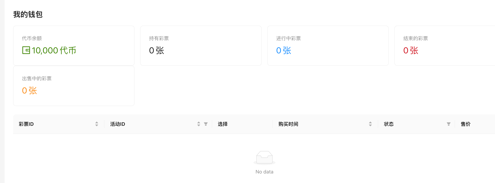
然后让他去购买第一张彩票
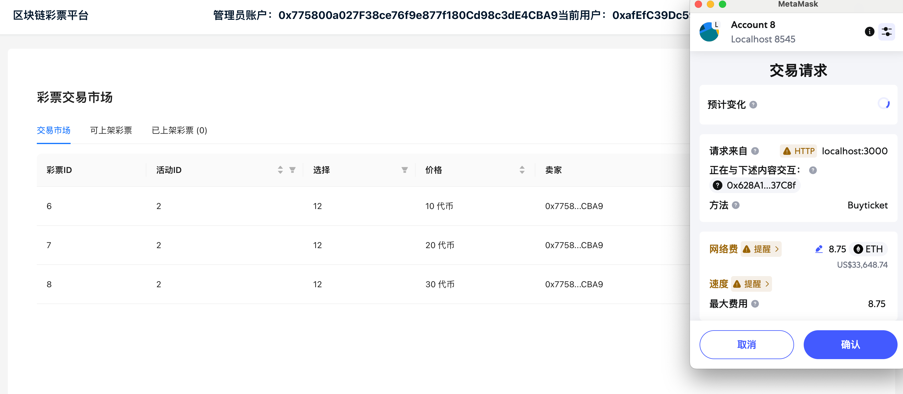
这时钱包变化了
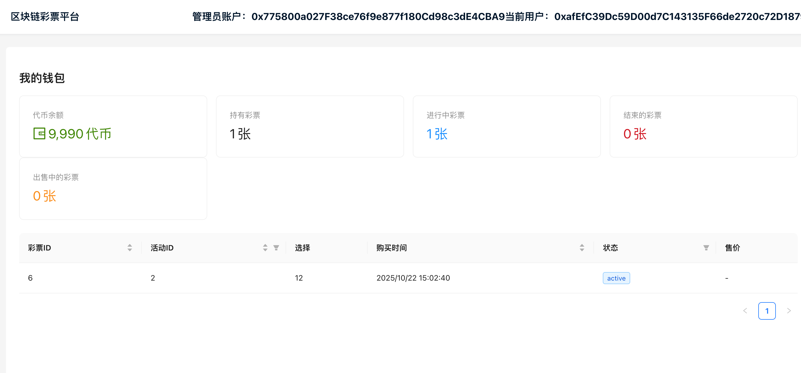
然后我们去开奖
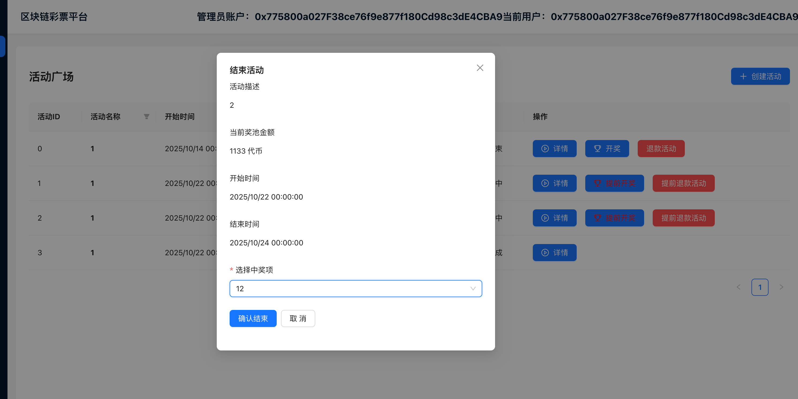
发现拿到这张彩票的人确实分到钱了
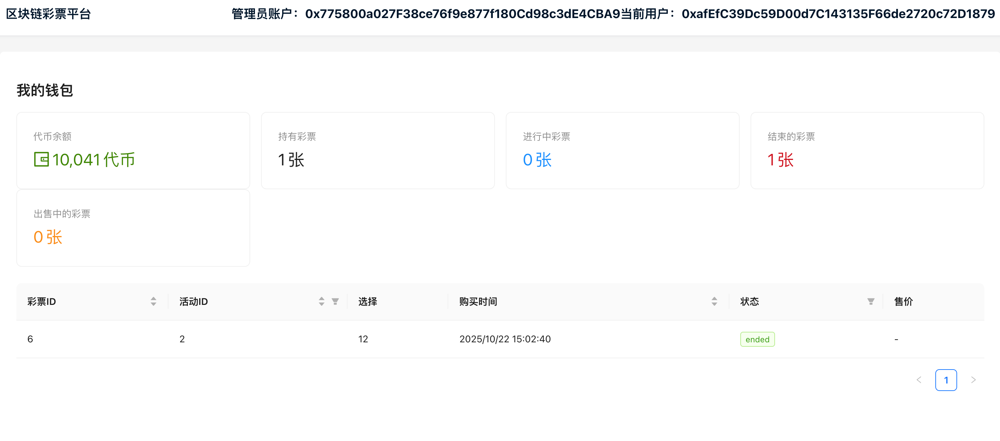
最后看看退款，首先购买完钱包如下
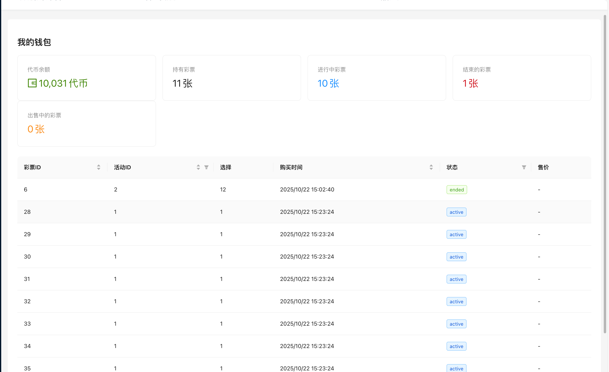
然后管理员去退钱
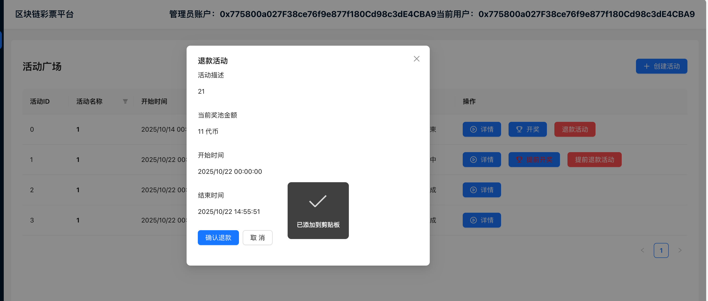
再查看钱包发现钱还了

## 参考内容

- 课程的参考Demo见：[DEMOs](https://github.com/LBruyne/blockchain-course-demos)。

- 快速实现 ERC721 和 ERC20：[模版](https://wizard.openzeppelin.com/#erc20)。记得安装相关依赖 ``"@openzeppelin/contracts": "^5.0.0"``。

- 如何实现ETH和ERC20的兑换？ [参考讲解](https://www.wtf.academy/en/docs/solidity-103/DEX/)

如果有其它参考的内容，也请在这里陈列。
